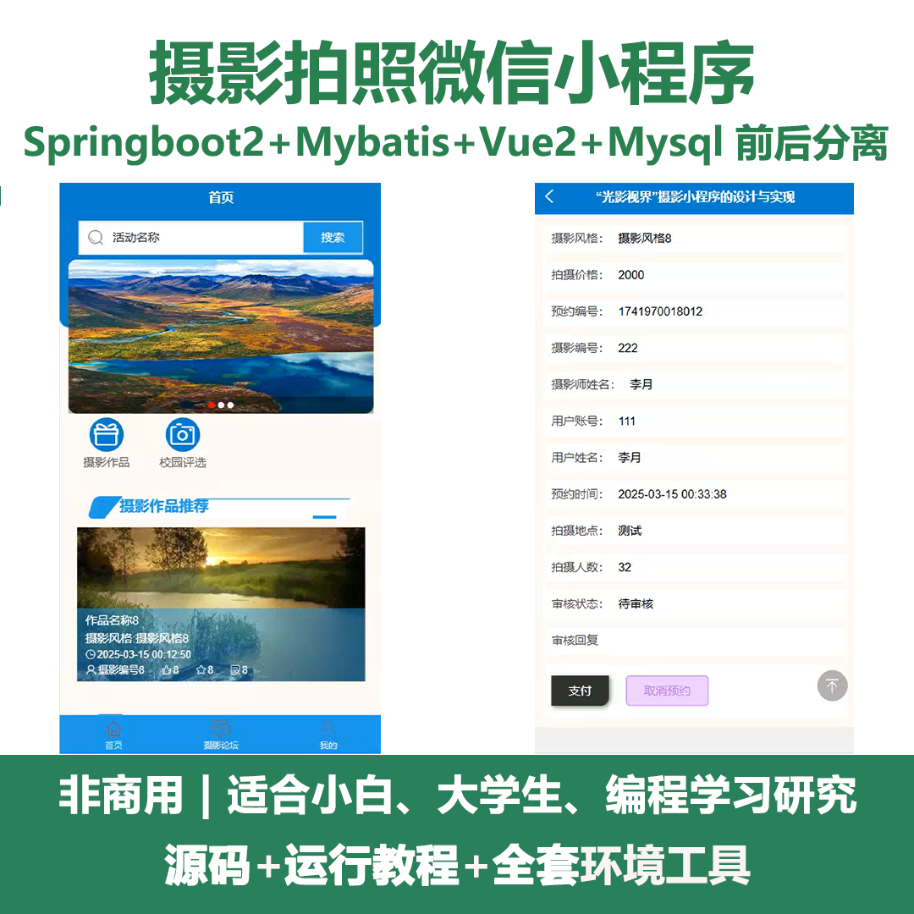
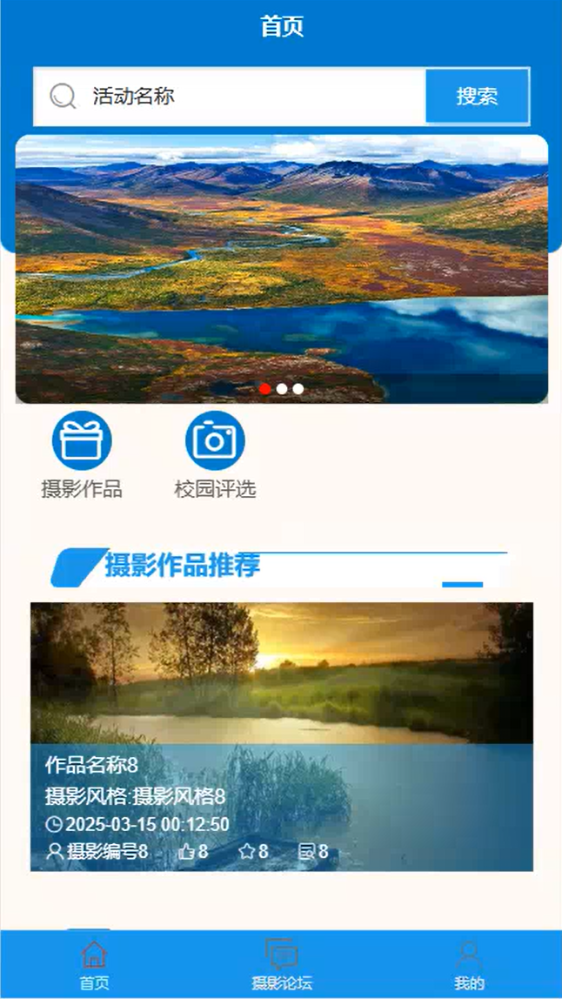
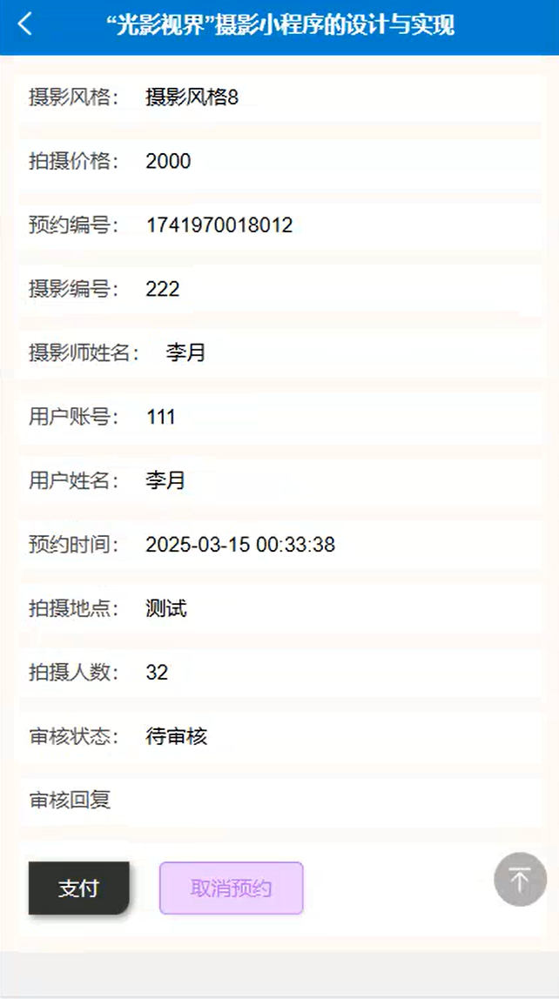
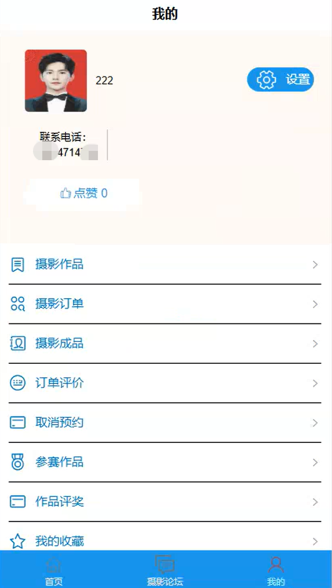
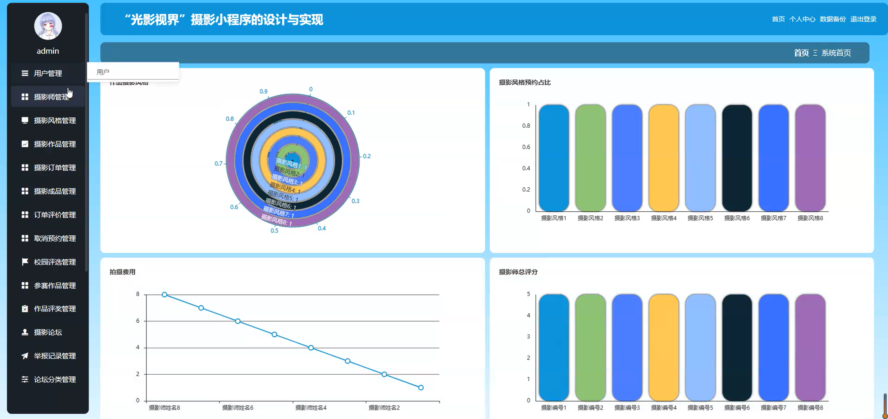
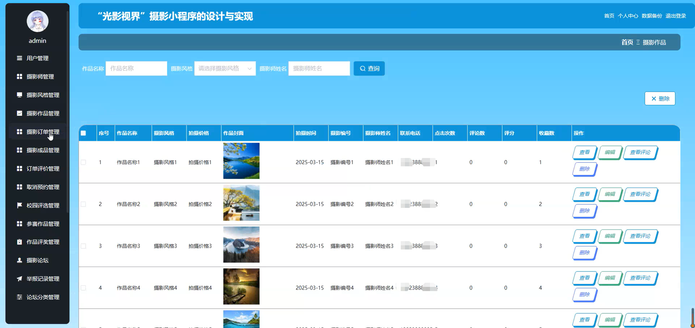
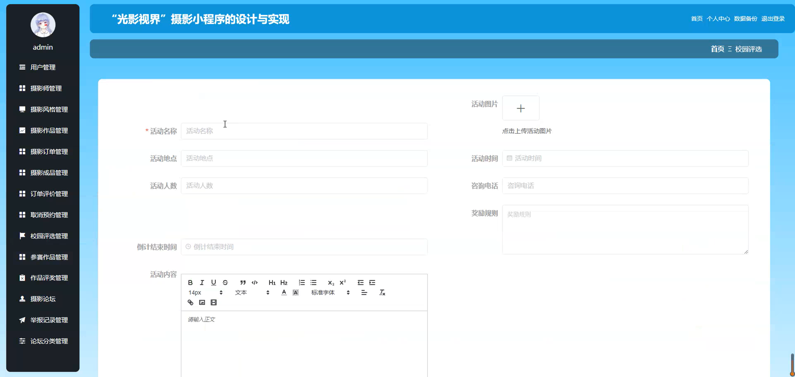
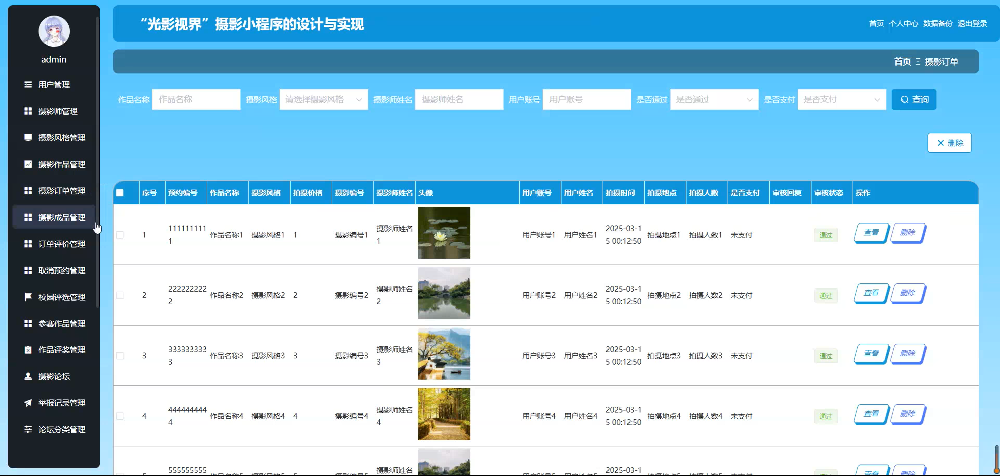

# mpweixinA204D
mpweixinA204D摄影拍照微信小程序
 
## 源码问题查看主页咨询

### 一、关键词
摄影作品管理，摄影订单管理，摄影风格管理

### 二、作品包含
源码+数据库+全套环境和工具资源+本地部署教程

### 三、项目技术
前端技术： Html、Css、Js、Vue2.0、Element-ui、uniapp
后端技术：Java、SpringBoot2.0、MyBatis

### 四、运行环境（以下版本亲测，其他版本兼容性请自行测试）
开发工具：IDEA/eclipse  + VSCODE + 微信开发者工具 + HBuilder X

数据库：MySQL5.7（最低要5.7版本）

数据库管理工具：Navicat10以上版本

环境配置软件： JDK1.8 + Maven3.6.3

前端Nodejs：14

浏览器：谷歌浏览器

### 五、项目介绍
项目编号：mpweixinA204D

摄影拍照微信小程序可便捷连接用户与摄影师，让摄影服务获取与业务开展更高效。

角色：管理员、用户、摄影师

管理员功能：用户管理、摄影师管理、摄影风格管理、摄影作品管理、摄影订单管理、摄影成品管理、订单评价管理、取消预约管理、校园评选管理、参赛作品管理、作品评奖管理、摄影论坛、举报记录管理、论坛分类管理、个人中心、数据备份、系统管理。

用户功能：首页、摄影论坛、我的、摄影作品、摄影订单、摄影成品、订单评价、取消预约、我的收藏、举报记录、我的发帖、聊天记录、修改密码。

摄影师功能：首页、摄影论坛、我的、摄影作品、摄影订单、摄影成品、订单评价、取消预约、参赛作品、作品评奖、我的收藏、举报记录、我的发帖、聊天记录、修改密码。

### 六、运行截图

